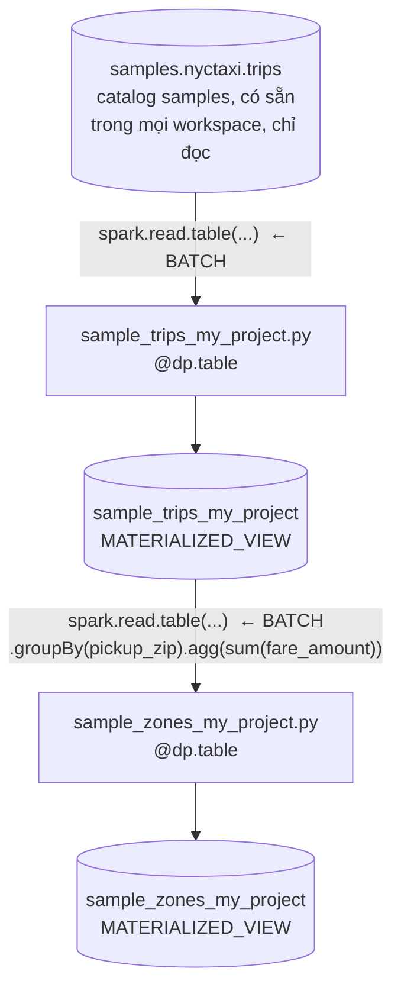
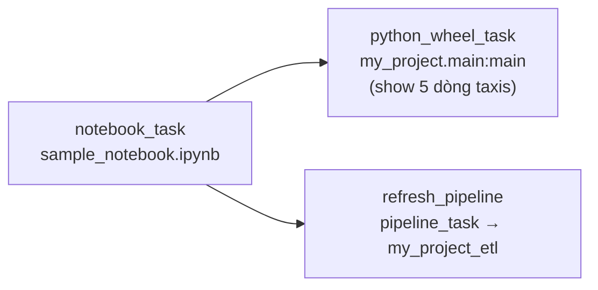
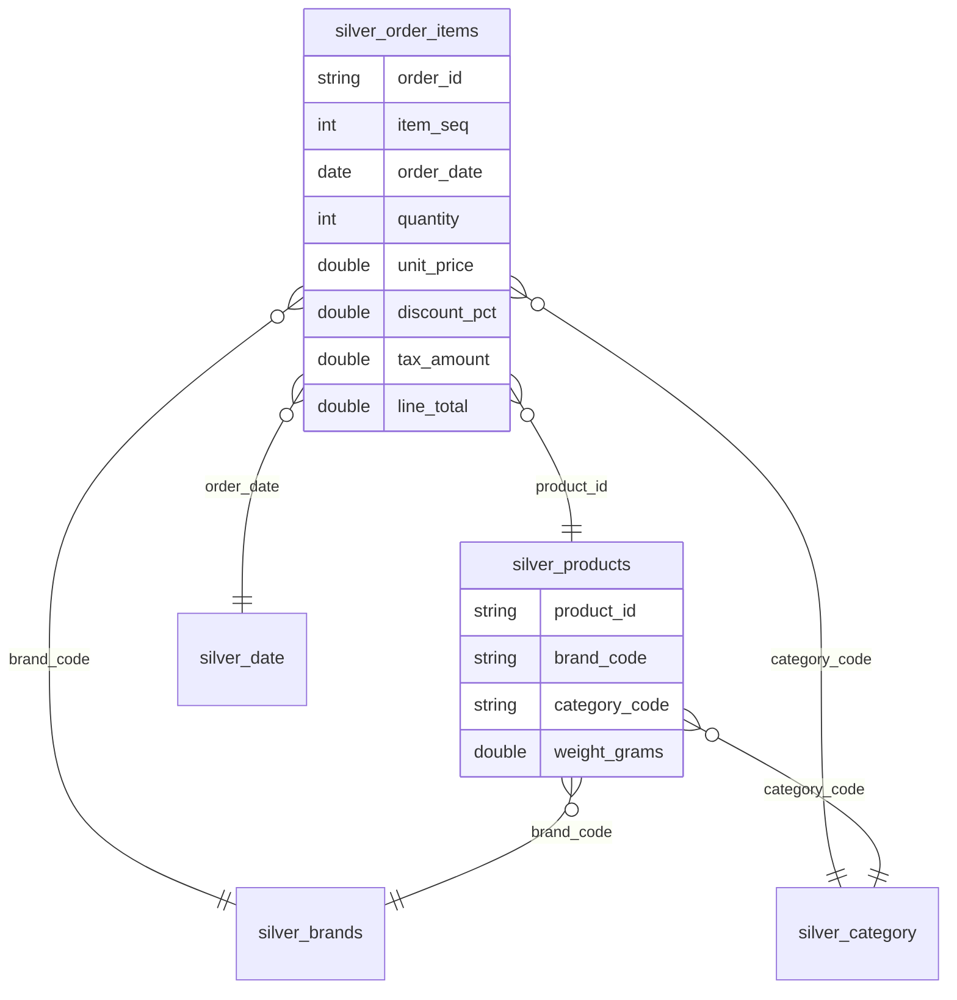
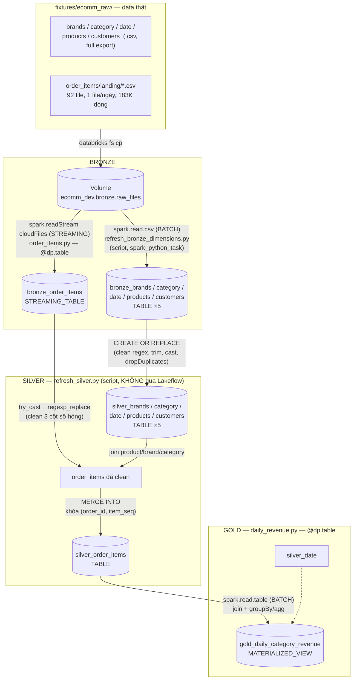
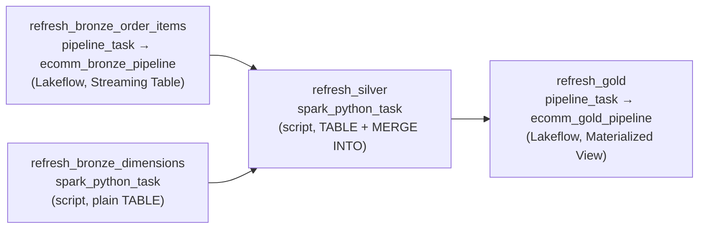
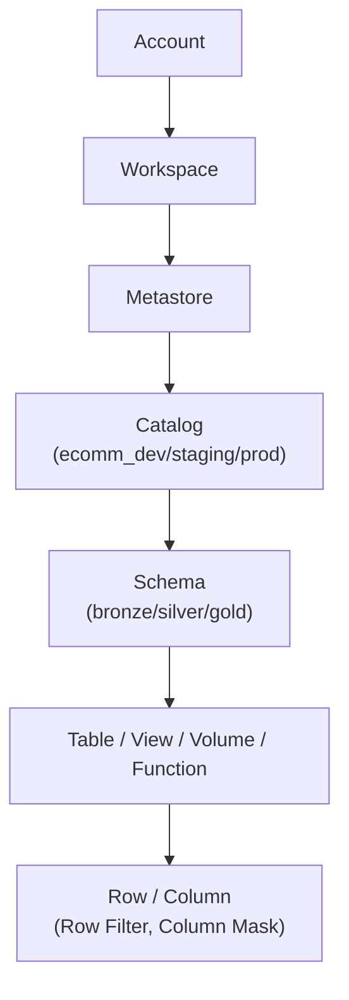
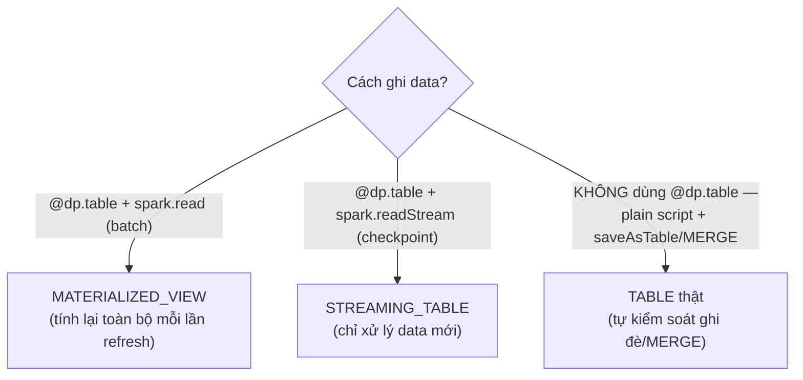

# Architecture

Repo này chỉ có **2 project**, độc lập nhau, không project nào phụ thuộc
hay thay thế project kia:

| Project | Vai trò | Trạng thái |
|---|---|---|
| **`nyctaxi` demo** (`my_project_etl`) | Demo mẫu có sẵn từ template, dùng để verify setup CLI/bundle/auth còn chạy được | 🟢 Xong, chỉ ở `dev` |
| **E-commerce project** (`ecomm_etl`) | Project chính — data thật, đủ Bronze/Silver/Gold + bảo mật | 🟢 Xong ở `dev`, chưa deploy `staging`/`prod` |

Mọi loại bảng nhắc tới dưới đây (`TABLE`, `STREAMING_TABLE`,
`MATERIALIZED_VIEW`) là 3 kết quả khác nhau của cùng 1 quyết định kỹ
thuật — xem giải thích gốc ở [phần cuối trang này](#tại-sao-ra-materialized_view-mà-không-phải-table)
và đầy đủ hơn ở [Bài 13](lessons/fundamentals/13-delta-table-job-vs-lakeflow.md).

---

## 1. `nyctaxi` demo

### 1.1 Data flow



### 1.2 File nào làm gì, và tại sao chọn vậy

| Bước | File | Công nghệ | Output | Vì sao |
|---|---|---|---|---|
| 1 | [`src/my_project_etl/transformations/sample_trips_my_project.py`](../src/my_project_etl/transformations/sample_trips_my_project.py) | `@dp.table` + `spark.read.table(...)` (batch) | `MATERIALIZED_VIEW` | Chỉ copy nguyên 1 bảng có sẵn — không cần incremental, không cần streaming. Batch read trong Lakeflow **luôn** ra Materialized View (xem mục 3). |
| 2 | [`src/my_project_etl/transformations/sample_zones_my_project.py`](../src/my_project_etl/transformations/sample_zones_my_project.py) | `@dp.table` + `spark.read.table(...)` + `groupBy/agg` (batch) | `MATERIALIZED_VIEW` | Aggregate (`sum(fare_amount)` theo `pickup_zip`) — đúng use-case kinh điển của Materialized View: query nặng, cache sẵn kết quả, tự refresh khi bảng nguồn đổi. |
| — | [`resources/my_project_etl.pipeline.yml`](../resources/my_project_etl.pipeline.yml) | Lakeflow declarative pipeline, `serverless: true` | — | Gom 2 file `@dp.table` ở trên thành 1 pipeline, tự lo thứ tự chạy (2 phụ thuộc 1) — không cần tự viết orchestration bên trong. |

### 1.3 Job orchestration (`sample_job`)

Định nghĩa: [`resources/sample_job.job.yml`](../resources/sample_job.job.yml)



- Trigger: `periodic`, mỗi 1 ngày — **bị pause tự động** ở target `dev`
  (`mode: development`); chỉ chạy thật theo lịch ở `prod`.
- `notebook_task` và `python_wheel_task` chỉ để minh hoạ 2 kiểu task khác
  của Databricks Jobs (notebook, wheel) — không đụng vào Bronze/Silver/Gold,
  tách biệt hoàn toàn khỏi `refresh_pipeline`.

### 1.4 Environments — trạng thái thật (đã verify)

| Target | Catalog.Schema | Đã deploy? | Đã có data? |
|---|---|---|---|
| `dev` | `workspace.<short_name>` (vd `mychivodoi123`) | ✅ | ✅ `sample_trips_my_project`, `sample_zones_my_project` |
| `staging` | `workspace.staging` | ❌ chưa từng deploy | ❌ (`SHOW TABLES` → `SCHEMA_NOT_FOUND`) |
| `prod` | `workspace.prod` | ❌ chưa từng deploy | ❌ (schema `prod` không tồn tại) |

→ **Demo `nyctaxi` mới chỉ chạy ở `dev`**, chưa từng deploy lên
`staging`/`prod` — không phải "đã xong hết chỉ còn thiếu chạy", mà là
resource `staging`/`prod` **chưa tồn tại** trên workspace.

---

## 2. E-commerce project

### 2.1 Data model (star schema thật, 183K dòng `order_items`)



### 2.2 Data flow — Bronze → Silver → Gold



### 2.3 File nào làm gì, và **tại sao** chọn công nghệ đó (áp đúng khung quyết định)

Khung quyết định áp dụng cho từng layer (không ép 1 công nghệ cho mọi
bảng — xem [Bài 13](lessons/fundamentals/13-delta-table-job-vs-lakeflow.md)):

| Tình huống khách hàng nói | → Công nghệ | Áp vào bảng nào |
|---|---|---|
| "Kafka có hàng ngàn event/giây, cần xử lý tăng dần" | **Streaming Table** (Auto Loader) | `bronze_order_items` — file mới đổ vào Volume liên tục theo ngày |
| "Mỗi đêm 2h chạy ETL, lấy data hôm qua rồi MERGE" (SAP-style) | **Delta Table + Job/Notebook** (script thường) | 5 dimension Bronze, toàn bộ Silver |
| "Gold query join 10 bảng, aggregate nặng, dashboard chạy lại hoài" | **Materialized View** | `gold_daily_category_revenue` |

| Bước | File | Công nghệ | Output | Vì sao chọn |
|---|---|---|---|---|
| Ingest raw | [`scripts/import_ecomm_raw_data.py`](../scripts/import_ecomm_raw_data.py) | Script Python thường, copy file | — (chỉ copy vào `fixtures/ecomm_raw/`) | Chạy 1 lần trên máy dev, không phải phần pipeline deploy — tách biệt "lấy data về" khỏi "xử lý data". |
| Bronze (5 dimension) | [`src/ecomm_etl/scripts/refresh_bronze_dimensions.py`](../src/ecomm_etl/scripts/refresh_bronze_dimensions.py) | Plain script, `spark.read.csv` (batch) + `saveAsTable(mode=overwrite)`, chạy qua `spark_python_task` | `TABLE` thật | Data dimension là **export lại toàn bộ mỗi lần** (giống export từ ERP mỗi đêm) — không có gì để "merge từng dòng", `CREATE OR REPLACE` đơn giản và đúng bản chất hơn Lakeflow. |
| Bronze (fact) | [`src/ecomm_etl/transformations/bronze/order_items.py`](../src/ecomm_etl/transformations/bronze/order_items.py) | `@dp.table` + `spark.readStream.format("cloudFiles")` (Auto Loader) | `STREAMING_TABLE` | 92 file đổ vào Volume liên tục theo ngày — Auto Loader tự nhớ (qua checkpoint) file nào đã đọc, mỗi lần refresh chỉ xử lý file **mới**, không quét lại 92 file cũ. |
| Silver (5 dimension + fact) | [`src/ecomm_etl/scripts/refresh_silver.py`](../src/ecomm_etl/scripts/refresh_silver.py) | Plain script, `spark_python_task` | `TABLE` thật ×6 | Dimension: `CREATE OR REPLACE` (giống Bronze, lý do như nhau). Fact (`silver_order_items`): **`MERGE INTO`** theo khóa `(order_id, item_seq)` — đúng pattern "ETL đêm lấy data mới rồi MERGE" — tự viết logic MERGE bằng `DeltaTable.merge()`, không cần `dp.create_auto_cdc_flow` vì tự kiểm soát toàn bộ transform (10 bug data thật đã fix ngay trong script này). |
| Gold | [`src/ecomm_etl/transformations/gold/daily_revenue.py`](../src/ecomm_etl/transformations/gold/daily_revenue.py) | `@dp.table` + `spark.read.table` (batch) + `join`/`groupBy`/`agg` | `MATERIALIZED_VIEW` | Join 2 bảng + aggregate theo ngày/category/brand cho dashboard — đúng use-case Materialized View: Lakeflow tự refresh, không cần tự code lại logic refresh. |
| Orchestration | [`resources/ecomm_job.job.yml`](../resources/ecomm_job.job.yml) | Databricks Job, 4 task | — | Nối `pipeline_task` (Lakeflow) và `spark_python_task` (script) **trong cùng 1 job** — job không quan tâm task chạy bằng công nghệ gì, chỉ cần đúng thứ tự phụ thuộc. |

### 2.4 Job orchestration (`ecomm_job`) — 4 task, trộn 2 công nghệ



Đã verify chạy `TERMINATED SUCCESS` ổn định qua nhiều vòng fix — chi tiết
đầy đủ 10 bug data thật đã tìm/fix: [roadmap/phase-1-ecommerce.md](roadmap/phase-1-ecommerce.md).

### 2.5 Security layer (GRANT/REVOKE + Row Filter/Column Mask + ABAC)



| Cơ chế | Áp được lên loại object nào | Đã áp lên bảng nào trong project | Trạng thái |
|---|---|---|---|
| **Legacy** `ALTER TABLE ... SET ROW FILTER` / `SET MASK` | Chỉ `TABLE`/`STREAMING_TABLE` thật (lỗi `EXPECT_TABLE_NOT_VIEW` trên Materialized View) | `bronze_order_items` (Streaming Table) | ✅ đã verify |
| **ABAC** (`CREATE GOVERNED TAG` + `SET TAGS` + `CREATE POLICY ... has_tag(...)`) | Mọi loại object, kể cả Materialized View | `bronze_customers`, `gold_daily_category_revenue` | ✅ đã verify |
| Test bằng identity độc lập | Service Principal (OAuth M2M), tránh owner-bypass | — | ✅ đã verify (owner luôn full-access, phải test bằng SP thật) |

Chi tiết đầy đủ (lệnh SQL thật, lỗi gặp phải, cách fix):
[lessons/fundamentals/12-permissions-hierarchy-and-abac.md](lessons/fundamentals/12-permissions-hierarchy-and-abac.md).

### 2.6 Environments — trạng thái thật (đã verify, không suy đoán)

Dùng **Pattern A — catalog-per-environment** (khác `nyctaxi` dùng
schema-per-environment) — đã verify không cần Premium:
[lessons/operations/01-free-edition-limitations.md](lessons/operations/01-free-edition-limitations.md).

| Target | Catalog | Đã deploy resource (job/pipeline)? | Đã có schema/data? |
|---|---|---|---|
| `dev` (`ecomm_dev`) | `ecomm_dev` | ✅ | ✅ `bronze`/`silver`/`gold` đầy đủ, GRANT/Row Filter/ABAC đã áp |
| `staging` (`ecomm_staging`) | `ecomm_staging` | ❌ chưa deploy | ❌ chỉ có `default`/`information_schema` — chưa có `bronze`/`silver`/`gold` |
| `prod` (`ecomm_prod`) | `ecomm_prod` | ❌ chưa deploy | ❌ chỉ có `default`/`information_schema` |

→ **Đúng như bạn nói**: e-commerce project đã **xong toàn bộ về mặt kỹ
thuật** ở `dev` (Bronze/Silver/Gold + bảo mật, verify chạy thật ổn định
nhiều vòng) — phần còn lại **duy nhất** là chạy
`databricks bundle deploy --target staging` /`--target prod` (chưa làm,
không phải vì vướng gì, mà vì Free Edition 1 workspace không cần tách
môi trường thật để học phần lõi).

---

## 3. Tại sao ra `MATERIALIZED_VIEW` mà không phải `TABLE`?

Đây là điểm hay bị hiểu nhầm nhất — kể cả tên bảng
(`sample_trips_my_project`) nghe như "table", `@dp.table` trong code cũng
tên là `table`, nhưng **không có lựa chọn "TABLE" nào cả**. `@dp.table`
là 1 decorator của Lakeflow, và nó chỉ ra **1 trong 2 kết quả**, quyết
định hoàn toàn bởi **1 dòng code duy nhất** trong hàm:

```python
@dp.table
def sample_trips_my_project():
    return spark.read.table("samples.nyctaxi.trips")   # ← spark.READ (batch)
    # => MATERIALIZED_VIEW
```

```python
@dp.table
def bronze_order_items():
    return spark.readStream.format("cloudFiles")...    # ← spark.READSTREAM (streaming)
    # => STREAMING_TABLE
```

| Trong hàm dùng | Lakeflow tạo ra | Vì sao |
|---|---|---|
| `spark.read...` (batch) | **`MATERIALIZED_VIEW`** | Không có khái niệm "đã xử lý tới đâu" — mỗi lần refresh, Lakeflow **tính lại toàn bộ kết quả** từ nguồn hiện tại, y hệt 1 view SQL nhưng cache sẵn kết quả (không query lại từ đầu mỗi lần đọc). |
| `spark.readStream...` (streaming, có checkpoint) | **`STREAMING_TABLE`** | Lakeflow nhớ đã đọc tới đâu (offset/checkpoint) — mỗi lần refresh chỉ xử lý dữ liệu **mới**, ghi **thêm** vào bảng, không tính lại từ đầu. |

`sample_trips_my_project`/`sample_zones_my_project` đều dùng
`spark.read.table(...)` (batch, không streaming) → **chắc chắn** ra
Materialized View, không phải do bug hay do thiếu cấu hình gì — đây là
hành vi được tài liệu Databricks định nghĩa rõ, không có cách nào ép
`@dp.table` + batch read ra `TABLE` thường.

Muốn có `TABLE` thật (không tự refresh, ghi 1 lần rồi thôi, hoặc ghi
bằng `MERGE`) → **không dùng Lakeflow `@dp.table`** — dùng plain script +
`saveAsTable()`/`DeltaTable.merge()`, chạy qua `spark_python_task` trong
Job. Đây chính xác là cách `refresh_bronze_dimensions.py` và
`refresh_silver.py` của e-commerce project làm — 2 file đó **không** có
`@dp.table`, nên ra `TABLE` thật, không phải Materialized View.

**Tóm lại — 3 lựa chọn, không phải 1:**



Xem thêm khung quyết định đầy đủ (khi nào chọn cái nào):
[Bài 13 — Delta Table + Job vs Streaming Table vs Materialized View](lessons/fundamentals/13-delta-table-job-vs-lakeflow.md).

---

## 4. Data thật của bạn (khi thay data mẫu `nyctaxi`)

Muốn thay `samples.nyctaxi.trips` bằng nguồn khác, chỉ cần đổi nguồn đọc
trong `src/my_project_etl/transformations/*.py`, ví dụ:

```python
spark.read.table(f"{catalog}.{schema}.ten_table_that")
```

Kiến trúc job/pipeline không đổi — chỉ đổi nguồn data ở tầng
transformation đầu tiên. Xem thêm roadmap 2 project:
[roadmap/OVERVIEW.md](roadmap/OVERVIEW.md).
